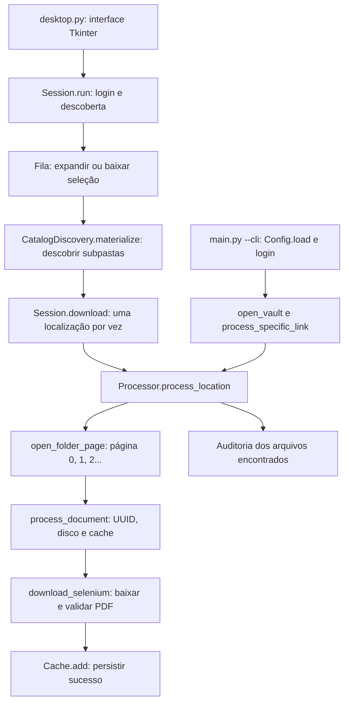

# Guia de desenvolvimento

## Preparar e executar

Siga a instalação do [README](README.md), incluindo os caminhos locais de Chrome e ChromeDriver. Execute os comandos dentro da pasta que contém este arquivo.

- `python desktop.py`: abre a interface Tkinter.
- `python main.py`: abre a interface Tkinter.
- `python main.py --cli`: executa o fluxo de terminal.
- `python -m pytest test -q`: executa os testes, após instalar suas dependências.

O código atual de inicialização do navegador depende de `USERPROFILE` e de executáveis Windows. Não considere o terminal compatível com uma VPS Linux sem adaptar e validar essa inicialização.

## Como o fluxo funciona

No desktop, a interface envia comandos para `Session` por uma fila. Uma thread executa a automação e devolve eventos para a interface. A sessão mantém o navegador aberto entre as operações até logout, cancelamento ou encerramento.

<<<<<<< HEAD
O login carrega a árvore pelo menu lateral. As subpastas são descobertas conforme o usuário expande os itens; ao baixar recursivamente, a sessão expande os ramos selecionados. Para cada localização, o processador percorre os documentos, verifica arquivos existentes, baixa os pendentes e realiza uma auditoria.
=======

>>>>>>> ef5aff3 (Atualizando Automação)

No terminal, `main.py` carrega `Config`, inicia o navegador, entra no cofre configurado e chama `process_specific_link()`. O navegador é fechado no bloco `finally`. Esse fluxo não percorre a árvore de subpastas como o desktop.

## Onde alterar

| Arquivo | Responsabilidade |
|---|---|
| [desktop.py](desktop.py) | Entrada do aplicativo gráfico |
| [main.py](main.py) | Entrada da interface por padrão; terminal com `--cli` |
| [d4sign/desktop.py](d4sign/desktop.py) | Telas, confirmação, eventos e atualização |
| [d4sign/session.py](d4sign/session.py) | Thread, comandos, sessão e downloads selecionados |
| [d4sign/discovery.py](d4sign/discovery.py) | Leitura e expansão do menu lateral |
| [d4sign/catalog.py](d4sign/catalog.py) | Árvore, seleção e caminhos locais |
| [d4sign/browser.py](d4sign/browser.py) | Chrome, login e navegação |
| [d4sign/parser.py](d4sign/parser.py) | UUID, nome e botão de download de cada linha |
| [d4sign/processor.py](d4sign/processor.py) | Paginação, processamento, download por linha e auditoria |
| [d4sign/downloader.py](d4sign/downloader.py) | Utilitários de download, HTTP, Selenium e arquivos temporários |
| [d4sign/cache.py](d4sign/cache.py) | Status por documento e renovação do JSON |
| [d4sign/config.py](d4sign/config.py) | Configuração e variáveis do terminal |
| [d4sign/models.py](d4sign/models.py) | Documentos, pastas e estatísticas |
| [d4sign/utils.py](d4sign/utils.py) | UUIDs, nomes e verificação básica de PDF |
| [d4sign/debug.py](d4sign/debug.py) | Diagnósticos |
| [d4sign/updates.py](d4sign/updates.py) | Consulta de versão e download verificado |
| [d4sign/version.py](d4sign/version.py) | Versão e repositório de atualização |

O fluxo principal de documentos usa `Processor.download_selenium()`. Não presuma que mudar apenas `Downloader.download_document()` alterará os downloads do desktop.

## Configuração do terminal

Crie um `.env` local com valores da sua conta, sem versioná-lo:

```dotenv
D4SIGN_EMAIL=seu-email
D4SIGN_PASSWORD=sua-senha
D4SIGN_VAULT_ID=id-do-cofre
D4SIGN_VAULT_UUID=uuid-do-cofre
DOWNLOAD_DIR=downloads
CACHE_FILE=cache.json
```

Depois execute `python main.py --cli`. E-mail e senha são obrigatórios. Configure explicitamente o cofre para evitar usar os valores específicos da Central Bolsas presentes no código.

| Variável | Padrão / efeito |
|---|---|
| `D4SIGN_BASE_URL` | `https://secure.d4sign.com.br` |
| `DOWNLOAD_DIR` | `downloads`, relativo ao diretório de execução |
| `CACHE_FILE` | `cache.json`, relativo ao diretório de execução |
| `HEADLESS` | `True`; aceita também `1`, `yes`, `sim` e `on` |
| `DEVELOPMENT` | Qualquer valor não vazio desativa o modo oculto no terminal |
| `PAGE_TIMEOUT` | `40` segundos |
| `DOWNLOAD_TIMEOUT` | `120` segundos |
| `DOWNLOAD_RETRIES` | `3` tentativas |
| `RETRY_DELAY` | `2` segundos, configuração usada pelos fluxos que a consultam |
| `LOG_FILE` | `d4sign_downloader.log`; carregar o valor não configura gravação automática de logs |
| `FOLDER_NAME_FILTER` | Carregado por compatibilidade; não filtra o fluxo atual de `main.py` |

O desktop monta sua própria configuração a partir da tela e não usa `Config.load()` para as credenciais. Seus padrões incluem Chrome oculto, 40 segundos para páginas, 120 para downloads e 3 tentativas.

## Arquivos e regras

O JSON guarda um mapa de localização para UUIDs, com `true` para baixado e `false` para pendente. A escrita usa um arquivo `.tmp` e substitui o JSON ao concluir.

A expiração usa `st_mtime`, a data da última modificação, e não uma data individual de download. Após 48 horas, a leitura exclui o JSON antigo e salva um vazio. O prazo reinicia a cada gravação. Essa rotina só roda com o programa em execução.

O cache auxilia o processamento, mas o PDF em disco precisa passar pelas verificações. Leia as [regras de duplicidade](CORRECAO_PDFS_REPETIDOS.md) antes de alterar essa parte. Evite duas instâncias gravando no mesmo destino: o cache não possui controle de concorrência entre processos.

O desktop consulta todas as situações de documentos; o terminal mantém o filtro de navegação padrão. `DocumentParser.finalized()` retorna `True` mesmo quando não encontra um marcador de finalizado. Portanto, esse método sozinho não garante filtragem por status.

## Diagnosticar problemas

| Sintoma | O que conferir |
|---|---|
| Chrome não inicia | Caminhos em `browser.py`, presença dos executáveis e compatibilidade do driver |
| Login falha | Credenciais, autenticação adicional e seletores do site |
| Pasta não aparece | HTML do menu, relações de parentesco e expansão em `discovery.py` |
| PDF ausente ou repetido | Mensagens do processador e `last_audit` |
| Cache não é renovado | Caminho usado e data da última gravação; alterações reiniciam as 48 horas |
| Atualização falha | Repositório, versão, asset, tamanho e digest esperados |

O desktop muda o diretório de trabalho para `%LOCALAPPDATA%\D4SignDesktop`. No terminal, caminhos relativos partem do diretório de onde o comando foi executado. Diagnósticos podem conter conteúdo da conta; revise-os antes de compartilhar.

## Atualizações e distribuição

O atualizador procura release estável mais recente no repositório de `version.py`, com asset `D4Sign-Setup-MAJOR.MINOR.PATCH.exe`. Confere a versão, a URL, o tamanho e o SHA-256. Não há token de autenticação embutido para repositórios privados.

O [workflow de release](.github/workflows/release.yml) usa Windows e Python 3.12, executa testes e verifica se a tag corresponde a `VERSION`. Tags geram release em rascunho; a execução manual gera artefato. Valide o aplicativo antes da publicação.

Consulte o [documento de gerar executável](<gerar novo executavel.md>) para o procedimento separado. Ao investigar o empacotamento, compare [build.ps1](scripts/build.ps1), [installer.iss](packaging/installer.iss) e o workflow, pois os caminhos de saída precisam coincidir.

## Antes de entregar uma mudança

Execute os [testes relacionados](test/README.md) e revise `git diff --check`. Mudanças de navegação precisam de validação manual no site além dos testes simulados. Atualize o guia correspondente quando mudar configuração, caminho de arquivo ou comportamento.
